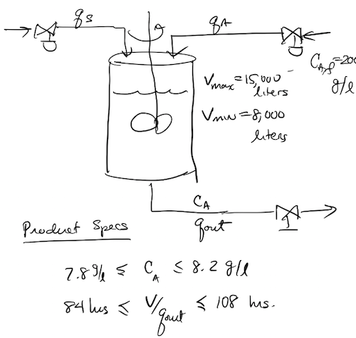

# DRL Experiments with a Continuous Mixing Process Simulation

#### Jayanth Nair

***Creating the DRL environment***

The environment is created by modifying the blending simulation code found [here][repo]

The following is the process schematic:

The objectives are:

- maintain the outlet concentration at 8 ± 0.2 grams/liter
- maintain average residence time of 96 ± 12 hours
- keep volume between 8,000 and 15,000 liters

The DRL environment is created using the custom environment wrappers provided in Stable Baselines3

***Training DRL agent***

Stable Baselines3 is used to train a DRL agent

***Scripts and files***
- mixing_env.py -> defines the environment
- train_model_mixer.py -> train DRL agent
- test_env.py -> test the environment
- load_model_mixer.py -> load DRL agent

[repo]: <https://jckantor.github.io/CBE30338/02.04-Continuous-Product-Blending.html>